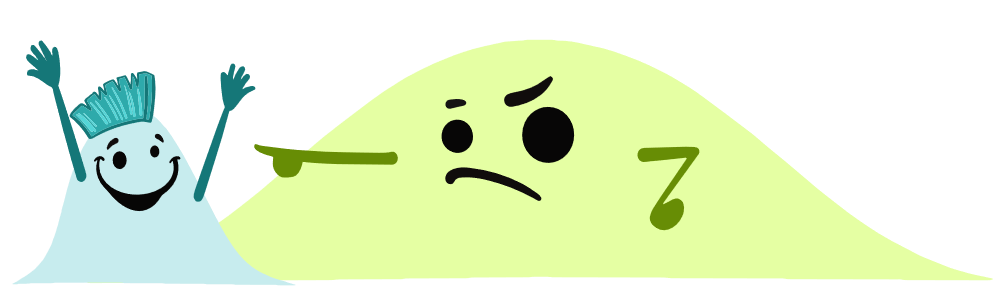
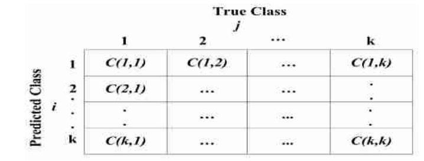

```{r setup, include = FALSE}
knitr::opts_chunk$set(
  #set comment formatting
  comment = ">",
  #collapse code and output
  collapse = F
)
```

```{r xaringan-themer, include=FALSE, warning=FALSE}
library(xaringanthemer)
style_mono_accent(
  base_color = "#000000",
  link_color = "#0000EE",
  header_font_google = google_font("Josefin Sans"),
  text_font_google   = google_font("Montserrat", "700b", "400"),
  code_font_google   = google_font("Fira Mono"),
  colors = c(
    red = "#ff7453",
    yellow = "#f2bd53",
    blue = "	#45abc1",
    white = "#FFFFFF"
  ),
  code_font_size = "smaller",
  code_inline_background_color = "#F4F4F4",
  outfile = "./custom/xaringan-themer.css"
)
```

```{r packages, warning=F, message=F, echo=F}
#install.packages("pacman")
if (!require("pacman")) install.packages("pacman")
pacman::p_load(tidyverse, showtext, yardstick, themis)
pacman::p_load_gh("allisonhorst/palmerpenguins", "hadley/emo")
```

name: agenda

## Agenda

**1 Learning Objectives**

**2 Introduction to Imbalanced Learning**

**3 Techniques for Addressing Class Imbalance**
>3.1 Sampling Strategies
>> 3.1.1 Random Oversampling  
3.1.2 Synthetic Minority Over-Sampling Technique (SMOTE)  
3.1.3 Borderline SMOTE  
3.1.4 Random Undersampling  
3.1.5 Informed NearMiss Undersampling 

>3.2 Case Weighting  
3.3 Excursus: Evaluation of Classification Models  
3.4 Tinkering with Classification Cutoffs

**4 Cost-Sensitive Learning**

---

## 1 Learning Objectives `r emo::ji("idea")`

This workshop serves as a gentle introduction to the field of imbalanced learning. You will not only learn about the peculiarities and implications of working with imbalanced data sets, but also how to address class imbalance within your machine learning pipeline.

More specifically, after this workshop you will
- be able to identify an imbalanced data set and know about its implications for modeling,<br><br>
- carry a toolbox of techniques for addressing class imbalance at various stages in your machine learning pipeline (e.g., data collection, resampling, model estimation or model evaluation),<br><br>
- have internalized basic (random under- and oversampling) and more advanced techniques of resampling (SMOTE, Borderline SMOTE, NearMiss),<br><br>
- know how to distinguish alternative routes to handling class imbalance, such as imbalanced learning or cost-sensitive learning.

---

## 2 Introduction to Imbalanced Learning

> An imbalance occurs when one or more classes have very low proportions in the training data as compared to the other classes. ~ [Kuhn, M./Johnson, K. (2019), p. 419](#references)

--

As can be inferred from this quote, the presence of class imbalance depends on the properties of your data set. It is a definition based on relations between two types of classes:
- **Majority class:** The class (or set of classes) which accounts for the vast majority of the samples.
- **Minority class:** The underrepresented class which is characterized by relatively few samples.

--

The relation between the number of samples in the majority vs. minority class is called the **class distribution** and it is often expressed in terms of ratios (e.g., 100:1) or percentages (e.g., 4% vs. 96%).
<br><br><br>
```{r, echo=F, out.height='50%', out.width='50%', fig.align='left'}

```

.pull-right[.footnote[
*Note: In this workshop we focus on class imbalance in the context of classification. Most of the ideas, however, analogously transfer to the realm of regression problems where outliers reflect the minority class.*

*Source: [Allison Horst](https://github.com/allisonhorst/stats-illustrations)*
]]

???
- class distribution for imbalanced data sets: skewed
- In most practical applications, such as fraud detection, churn prediction or bankruptcy prediction, you are particularly interested in correctly predicting the *minority class*.

---

background-image: url(https://raw.githubusercontent.com/allisonhorst/palmerpenguins/master/man/figures/lter_penguins.png)
background-position: 95% 5%
background-size: 15%
layout: false

## 2 Introduction to Imbalanced Learning

```{r, echo=F}
model_df <- penguins %>% 
  drop_na %>% 
  filter(species == "Adelie") %>% 
  mutate(response = as.factor(if_else(flipper_length_mm >= 200, 1, 0)))

predictions <- glm(response ~ bill_length_mm + bill_length_mm, data = model_df, family = "binomial")$fitted.values

conf_mat <- model_df %>% 
  add_column(predictions) %>% 
  mutate(across(predictions, ~ { if_else(. > .5, 1, 0) %>% factor(., levels = c(0, 1)) } )) %>% 
  conf_mat(truth = response, estimate = predictions)
```

.pull-left[
**Implication of imbalanced learning regimes:** There is only very few information in the minority class for a model to learn from. This may lead to
- an overemphasis of the majority class,
- poorly calibrated prediction models,
- a focus on detrimental model candidates.

```{r, echo=F, fig.width=8, fig.asp=0.618, fig.retina=3, fig.align='center'}
model_df %>% 
  ggplot(aes(x = bill_length_mm, y = bill_depth_mm)) +
    geom_point(aes(color = response), size = 2) +
    scale_color_manual(values = c("#addd8e", "#c51b8a")) +
    theme_classic() +
    labs(
      title = "Distribution of Adelie Penguins",
      subtitle = "Positive Class: Flipper Length >= 200mm (ratio ~ 15:1)",
      x = "Bill Length [mm]",
      y = "Bill Depth [mm]"
    ) +
    theme(
      legend.position = "bottom",
      legend.title = element_blank(),
      plot.title = element_text(size = 14, face = "bold"),
      plot.subtitle = element_text(size = 12),
      axis.text = element_text(size = 10),
      axis.title = element_text(size = 10),
    )
```
]

--

.pull-right[
Let's consider the following confusion matrix which belongs to a classification model that was trained on the penguin data:
```{r, echo=F, fig.align='center'}
conf_mat
```
A *naive classifier* which always predicts the negative class will be correct `r round((1 - 9 / 137) * 100, 1)`% of the time. `r emo::ji('astonished')`
]

???
Example:
- We look only at Penguins of the "Adelie" Species
- Plotted by Bill Length (Schnabellänge) und Bill Depth (Schnabeltiefe im Profil)
- Artificial Example: Classify penguins by Flipper Length of 200+ (positive class)
- here: overlapping distribution

93.43 = predictive accuracy
- no indication about the type of error
- can be devastating in some errors of application (e.g., cancer diagnosis)
- and if we next look at the confusion matrix we can clearly see a bias towards the majority class

---

## Recap: The Generic Machine Learning Pipeline

```{r, echo=F, out.height='55%', out.width='55%', fig.align='center', out.extra='style="float:right; padding:10px"'}
knitr::include_graphics("https://ml-ops.org/img/ml-engineering.jpg")
```

**.yellow[Data Pipeline]**

>1 Data ingestion  
2 Data exploration (EDA)  
3 Data wrangling  
4 Data partitioning / resampling

**.red[ML Pipeline]**

>5 Model training  
6 Model evaluation / testing  
7 Model packaging

**.blue[Software & Code Pipeline]**

>8 Model deployment  
9 Model performance monitoring  
10 Model performance logging

.footnote[*Source: [ml-ops.org](https://ml-ops.org/content/end-to-end-ml-workflow)*]

???
different steps within our pipeline where we can address class imbalance:
- data collection
- resampling
- model training / estimation
- model evaluation

---

## 3 Techniques for Addressing Class Imbalance
### 3.1 Sampling Strategies (*Data Collection* / *Resampling*)

The upcoming techniques address the issue of class imbalance by implementing sampling strategies that prevent imbalances, either a priori (prior to *data collection*) or post hoc (after *data collection*).

--

**A priori:** Collect data in a way that directly ensures a uniform class distribution.

--

**Post hoc:** Set up your resampling approach (e.g., cross-validation, bootstrapping) in a way that ensures a uniform class distribution.
- Oversampling (also: upsampling)
- Undersampling (also: downsampling)
- Hybrid approaches (mixture of over- and undersampling)

.footnote[
*Note: The resampling strategies are model-agnostic as class imbalance is addressed on the data level. Eventually, model performance must be assessed on an imbalanced test set to receive a realistic estimate of the model's performance.*
]

---

## 3.1 Sampling Strategies (*Resampling*)
### 3.1.1 Random Oversampling

.pull-left[
```{r, echo=F, fig.width=8, fig.asp=0.618, fig.retina=3, fig.align='center', warning=F}
model_df %>% 
  recipe(response ~ bill_length_mm + bill_depth_mm, data = .) %>%
  step_upsample(response, over_ratio = 1, seed = 2020) %>%
  prep() %>%
  juice() %>% 
  ggplot(aes(x = bill_length_mm, y = bill_depth_mm)) +
    geom_jitter(aes(color = response), width = 0.15, height = 0.15) +
    scale_color_manual(values = c("#addd8e", "#c51b8a")) +
    theme_classic() +
    labs(
      title = "Distribution of Adelie Penguins",
      subtitle = "Oversampling to Increase the Size of the Minority Class",
      x = "Bill Length [mm]",
      y = "Bill Depth [mm]"
    ) +
    theme(
      legend.position = "none",
      legend.title = element_blank(),
      plot.title = element_text(size = 14, face = "bold"),
      plot.subtitle = element_text(size = 12),
      axis.text = element_text(size = 10),
      axis.title = element_text(size = 10),
    )
```
]
.pull-right[
**Random oversampling:** Take all cases from the majority class in the training set and complement it by drawing random samples with replacement from the minority class.
- The training set size is determined by the size of the majority class.
- The classifier may extract information from one sample several times.
- Duplication of potentially uninformative samples and risk of overfitting.
]

.footnote[
*Note: This plot uses `geom_jitter()` from the `ggplot2` package. Thus, the generated samples are slightly shifted. In reality, they have the exact same values as the three original positive samples.*
]

---

## 3.1 Sampling Strategies (*Resampling*)
### 3.1.2 Synthetic Minority Over-Sampling Technique (SMOTE)

.pull-left[
```{r, echo=F, fig.width=8, fig.asp=0.618, fig.retina=3, fig.align='center', warning=F}
model_df %>% 
  recipe(response ~ bill_length_mm + bill_depth_mm, data = .) %>%
  step_smote(response, over_ratio = 1, neighbors = 3, seed = 2020) %>%
  prep() %>%
  juice() %>% 
  ggplot() +
    geom_jitter(aes(x = bill_length_mm, y = bill_depth_mm, color = response), width = 0.05, height = 0.05) +
    geom_point(data = model_df %>% filter(response == 1), aes(x = bill_length_mm, y = bill_depth_mm), shape = 17, size = 3) +
    scale_color_manual(values = c("#addd8e", "#c51b8a")) +
    theme_classic() +
    labs(
      title = "Distribution of Adelie Penguins",
      subtitle = "SMOTE to Increase the Size of the Minority Class (k = 3)",
      x = "Bill Length [mm]",
      y = "Bill Depth [mm]"
    ) +
    theme(
      legend.position = "none",
      legend.title = element_blank(),
      plot.title = element_text(size = 14, face = "bold"),
      plot.subtitle = element_text(size = 12),
      axis.text = element_text(size = 10),
      axis.title = element_text(size = 10),
    )
```
]
.pull-right[
**SMOTE:** Take the minority class and generate additional synthetic samples by using *k*-NN. [[2](#references)]
- The classifier can leverage new samples which are similar but not equal to the original ones.
- SMOTE enriches the minority class feature space by filling it (instead of extending it).

**Algorithm:**
1. Randomly select a minority class sample as well as its *k* nearest neighbors.
2. Randomly create a synthetic sample along the vector between the minority class sample and each nearest neighbor.
3. Repeat till desired class distribution is reached.
]


???
- k-NN: k neareast neighbor algorithm where k is the number of nearest neighbors considered.
- step 1: nearest neighbors are also from the minority class
- Step 2: i have 4 samples, i.e. 3 nearest neighbours. create 3 synthetic samples and then again select new sample randomly.

---

## 3.1 Sampling Strategies (*Resampling*)
### 3.1.3 Borderline SMOTE

.pull-left[
```{r, echo=F, fig.width=8, fig.asp=0.618, fig.retina=3, fig.align='center', warning=F}
model_df %>% 
  recipe(response ~ bill_length_mm + bill_depth_mm, data = .) %>%
  step_bsmote(response, all_neighbors = FALSE, over_ratio = 1, neighbors = 2, seed = 2020) %>%
  prep() %>%
  juice() %>% 
  ggplot() +
    geom_jitter(aes(x = bill_length_mm, y = bill_depth_mm, color = response), width = 0.05, height = 0.05) +
    geom_point(data = model_df %>% filter(response == 1), aes(x = bill_length_mm, y = bill_depth_mm), shape = 17, size = 3) +
    scale_color_manual(values = c("#addd8e", "#c51b8a")) +
    theme_classic() +
    labs(
      title = "Distribution of Adelie Penguins",
      subtitle = "Borderline SMOTE1 to Increase the Size of the Minority Class (k = 2)",
      x = "Bill Length [mm]",
      y = "Bill Depth [mm]"
    ) +
    theme(
      legend.position = "none",
      legend.title = element_blank(),
      plot.title = element_text(size = 14, face = "bold"),
      plot.subtitle = element_text(size = 12),
      axis.text = element_text(size = 10),
      axis.title = element_text(size = 10),
    )
```
]
.pull-right[
**Three types of minority class samples:**
- *Safe* (all nearest neighbors of minority class)
- *Lost* (all nearest neighbors of majority class)
- *Borderline* (> 50% neighbors of majority class)

**Borderline SMOTE:** Take the *borderline samples* in the minority class and generate additional synthetic samples by using *k*-NN to improve model accuracy in uncertain regions. [[3](#references)]
- **Borderline SMOTE1:** Create synthetic samples only from minority class nearest neighbors (i.e. filling the minority class feature space).
- **Borderline SMOTE2:** Create synthetic samples from all nearest neighbors (i.e. extending the minority class feature space).
]

???
Borderline SMOTE focuses on uncertain samples (safe and lost samples are certain)

---

## 3.1 Sampling Strategies (*Resampling*)
### 3.1.4 Random Undersampling

.pull-left[
```{r, echo=F, fig.width=8, fig.asp=0.618, fig.retina=3, fig.align='center', warning=F}
model_df %>% 
  recipe(response ~ bill_length_mm + bill_depth_mm, data = .) %>%
  step_downsample(response, under_ratio = 1, seed = 2020) %>%
  prep() %>%
  juice() %>% 
  ggplot(aes(x = bill_length_mm, y = bill_depth_mm)) +
    geom_jitter(aes(color = response), width = 0.05, height = 0.05) +
    scale_color_manual(values = c("#addd8e", "#c51b8a")) +
    theme_classic() +
    labs(
      title = "Distribution of Adelie Penguins",
      subtitle = "Downsampling to Reduce the Size of the Majority Class",
      x = "Bill Length [mm]",
      y = "Bill Depth [mm]"
    ) +
    theme(
      legend.position = "none",
      legend.title = element_blank(),
      plot.title = element_text(size = 14, face = "bold"),
      plot.subtitle = element_text(size = 12),
      axis.text = element_text(size = 10),
      axis.title = element_text(size = 10),
    )
```
]
.pull-right[
**Random undersampling:** Take all cases from the minority class in the training set and complement it by drawing random samples with replacement from the majority class.
- The training set size is determined by the size of the minority class.
- The classifier extracts information only from a subset of all available samples.
- Deletion of potentially informative samples.
]

---

## 3.1 Sampling Strategies (*Resampling*)
### 3.1.5 Informed NearMiss Undersampling 

.pull-left[
```{r, echo=F, fig.width=8, fig.asp=0.618, fig.retina=3, fig.align='center', warning=F}
model_df %>% 
  recipe(response ~ bill_length_mm + bill_depth_mm, data = .) %>%
  step_nearmiss(response, under_ratio = 1, neighbors = 5, seed = 2020) %>%
  prep() %>%
  juice() %>% 
  ggplot(aes(x = bill_length_mm, y = bill_depth_mm)) +
    geom_jitter(aes(color = response), width = 0.05, height = 0.05) +
    scale_color_manual(values = c("#addd8e", "#c51b8a")) +
    theme_classic() +
    labs(
      title = "Distribution of Adelie Penguins",
      subtitle = "NearMiss-1 Undersampling to Reduce the Size of the Majority Class",
      x = "Bill Length [mm]",
      y = "Bill Depth [mm]"
    ) +
    theme(
      legend.position = "none",
      legend.title = element_blank(),
      plot.title = element_text(size = 14, face = "bold"),
      plot.subtitle = element_text(size = 12),
      axis.text = element_text(size = 10),
      axis.title = element_text(size = 10),
    )
```
]
.pull-right[
**Informative NearMiss undersampling:** Take only informative samples from the majority class, i.e. samples which are expected to be close to the empirical decision boundary, to improve accuracy in uncertain regions. [[4](#references)]
- **NearMiss-1:** Select majority class samples with minimum average distances to *k* nearest neighbors from the minority class.
- **NearMiss-2:** Select majority class samples with minimum average distances to *k* farthest neighbors from the minority class.
- **NearMiss-3:** Select *k* majority class samples with minimum distances to the minority class sample.
]

???
- again builds on k-NN
- near-miss-3: ensures surrounding and focuses on samples close to the decision boundary

---

## 3 Techniques for Addressing Class Imbalance
### 3.1 Sampling Strategies (*Resampling*)

```{r, echo=F, out.width='25%', out.height='25%', out.extra='style="float:right; padding:10px"'}
knitr::include_graphics("https://camo.githubusercontent.com/4da51d5ade52abe55b211efa50de0bc26cf025e5/68747470733a2f2f74686973686f6c6c6f7765617274682e66696c65732e776f726470726573732e636f6d2f323031322f30372f7468656d69732e6a7067")
```

**Additional remarks:**
- The effectiveness of the different sampling techniques depends heavily on the underlying data as well as the applied model.<br><br>
- In practice, it is often sufficient to eliminate severe imbalance and keep a slight imbalance (e.g., 60:40), i.e. a 1:1 ratio as advocated here is not always required.<br><br>
- You may consider the ratio (as well as the number of nearest neighbors) as potential hyperparameters in your modeling workflow.<br><br>
- Even though the examples center around a 2-dimensional feature space, the techniques easily generalize to higher dimensional feature spaces.<br><br>
- The `themis` package is a good place to start when facing class imbalance in your modeling pipeline. 
---

layout: false
class: center, middle

# 5-Minute Break<br><br>`r emo::ji("coffee")` `r emo::ji("doughnut")`

---

## 3 Techniques for Addressing Class Imbalance
### 3.2 Case Weighting (*Model Estimation*)

.pull-left[
```{r, echo=F, fig.width=8, fig.asp=0.618, fig.retina=3, fig.align='center', warning=F}
model_df %>% 
  ggplot(aes(x = bill_length_mm, y = bill_depth_mm)) +
    geom_point(aes(color = response, size = response)) +
    scale_color_manual(values = c("#addd8e", "#c51b8a")) +
    theme_classic() +
    labs(
      title = "Distribution of Adelie Penguins",
      subtitle = "Case Weighting to Accentuate the Minority Class",
      x = "Bill Length [mm]",
      y = "Bill Depth [mm]"
    ) +
    theme(
      legend.position = "none",
      legend.title = element_blank(),
      plot.title = element_text(size = 14, face = "bold"),
      plot.subtitle = element_text(size = 12),
      axis.text = element_text(size = 10),
      axis.title = element_text(size = 10),
    )
```
]
.pull-right[
Assign higher *case weights* to samples of the minority class when training the classifier.

For some model families, this is equivalent to generating duplicate samples with identical feature values.
]

.footnote[
*Note: In some sense this approach is very similar to random oversampling as discussed previously.*
]

---

## 3.3 Excursus: Evaluation of Classification Models
### 3.3.1 Confusion Matrix

.pull-left[
After having successfully trained a classification model, we are generally interested in its out-of-sample performance. Let's again look at the **confusion matrix** mentioned above:
]
.pull-right[
```{r, echo=F, fig.align='center'}
conf_mat
```
]

--

**True Positives:** $TP=$ 0  
Correctly predicted positive cases (positive cases predicted as positive)

**False Positives:** $FP=$ 0   
Incorrectly predicted negative cases (negative cases predicted as positive)

**True Negatives:** $TN=$ 137  
Correctly predicted negative cases (negative cases predicted as negative)

**False Negatives:** $FN=$ 9  
Incorrectly predicted positive cases (positive cases predicted as negative)

---

## 3.3 Excursus: Evaluation of Classification Models
### 3.3.1 Confusion Matrix

.pull-left[
After having successfully trained a classification model, we are generally interested in its out-of-sample performance. Let's again look at the **confusion matrix** mentioned above:
]
.pull-right[
```{r, echo=F}
conf_mat
```
]

**Sensitivity:** $sens=TP/(TP+FN)=$ 0 / (0 + 9) = 0  
The proportion of positives that are correctly classified (also called *True Positive Rate (TPR)* or *Recall*)

**Specificity:** $spec=TN/(FP+TN)=$ 137 / (0 + 137) = 1   
The proportion of negatives that are correctly classified

--

This discrepancy between *sensitivity* and *specificity* highlights the trade-off inherent to the two metrics: Optimizing for the correct prediction of the positive (negative) class results in a higher chance of FP (FN). Hence, it is merely a trade-off between the two types of classification error.

--

`r emo::ji("thinking")` **What if we simply shift the cutoff (e.g., 0.5) for classifying a sample into the positive class?**

???
- shift: in this case lower the threshold to make it more likely to predict a sample as positive.
- here the underlying model is a logistic regression which gives us predicted probabilities.
- other classifiers (e.g., SVM) may give us other outputs that help us to discriminate between classes

---

## 3.3 Excursus: Evaluation of Classification Models
### 3.3.2 Receiver Operating Characteristic (ROC)-Curve

.pull-left[
```{r, echo=F, fig.width=8, fig.asp=0.618, fig.retina=3, fig.align='center'}
points <- tibble(
  one_minus_spec = c(0, 1, 0, .05, .5, .5, (1-0.70072993)),
  sens = c(0, 1, 1, .5, .95, .5, 0.8888889),
  label = c("A", "B", "C", "D", "E", "F", "G")
)

p <- model_df %>% 
  add_column(predictions) %>% 
  yardstick::roc_curve(truth = response, estimate = predictions, event_level = "second") %>%
  ggplot(aes(x = 1 - specificity, y = sensitivity)) +
    geom_path(size = 1) +
    geom_abline(lty = 3) +
    coord_equal() +
    geom_label(data = points, aes(x = one_minus_spec, y = sens, label = label)) +
    theme_classic() +
    labs(
      title = "ROC-Curve for the Penguin Classification Problem",
      subtitle = "Positive Class: Flipper Lenght >= 200mm (ratio ~ 15:1)",
      x = "1 - Specificity (False Positive Rate)",
      y = "Sensitivity (True Positive Rate)"
    ) +
    theme(
      legend.position = "none",
      legend.title = element_blank(),
      plot.title = element_text(size = 14, face = "bold"),
      plot.subtitle = element_text(size = 12),
      axis.text = element_text(size = 10),
      axis.title = element_text(size = 10),
    )

p
```
]
.pull-right[
**ROC-curve:** Step function created by gradually lowering (from `+inf` to `-inf`) the cutoff ( $c$ ) for classifying a sample as positive. It aggregates all possible confusion matrices and creates a performance profile of the classifier. [[5](#references)]

**A:** Our classifier ( $sens=$ 0, $spec=$ 1) which never issues positive predictions ( $c=$ 0.5 ).<br><br>
**B:** The opposite classifier which only issues positive predictions.<br><br>
**C:** The perfect classifier which always predicts the class correctly.
]

???
- ROC-curve can be created for any classifier that outputs some kind of ranking
- each point on the ROC-curve corresponds to a single confusion matrix.
- more nuanced view than plain vanilla accuracy

---

## 3.3 Excursus: Evaluation of Classification Models
### 3.3.2 Receiver Operating Characteristic (ROC)-Curve

.pull-left[
```{r, echo=F, fig.width=8, fig.asp=0.618, fig.retina=3, fig.align='center'}
p
```
]
.pull-right[
**D:** A conservative classifier which only issues positive predictions with sufficient evidence (hence, producing few TP and FP).<br><br>
**E:** A liberal classifier which issues positive predictions more liberally (hence, producing many TP but also FP).<br><br>
**F:** A random classifier which issues positive predictions according to a coin-toss.<br><br>
**G:** Our classifier ( $sens=$ 0.8889, $spec=$ 0.7007) with an optimized cutoff ( $c=$ 0.0699 ).<br><br>
**Lower right triangle:** A classifier that performs worse than random.
]

???
- random classifier: to move form F towards the top-right corner, the classifier must exploit some of the information hidden in the data
- worse than random classifier: Technically, such a classifier does not exist as you could simply invert the predictions (e.g., FP become TN).

---

## 3.3 Excursus: Evaluation of Classification Models
### 3.3.2 Receiver Operating Characteristic (ROC)-Curve

.pull-left[
```{r, echo=F, fig.width=8, fig.asp=0.618, fig.retina=3, fig.align='center'}
p
```
]
.pull-right[
**Properties of the cutoff $c$ :** In general, the variation of the cutoff does not need to adhere to predicted probabilities! Any uncalibrated score that allows to rank predictions is sufficient.

**Optimal strategy:** Choose the cutoff so that the classifier is closest to the top-left corner of the ROC-plot.
- This approach does not alter the classifier!
- It does simply move samples up and down in the confusion matrix.

`r emo::ji("thinking")` **What if we compare different classifiers with intersecting ROC-curves?**
]

???
- changing cutoffs is also referred to as post-processing

---

## 3.3 Excursus: Evaluation of Classification Models
### 3.3.3 Area under the ROC-Curve (ROC-AUC)

.pull-left[
```{r, echo=F, fig.width=8, fig.asp=0.618, fig.retina=3, fig.align='center'}
df_a <- penguins %>% 
  drop_na %>% 
  mutate(response = if_else(species == "Adelie" | species == "Gentoo", 1, 0) %>% as.factor,
         pred = glm(species ~ bill_length_mm + bill_length_mm + flipper_length_mm, data = ., family = "binomial")$fitted.values)
   
df_b <- penguins %>% 
  drop_na %>% 
  mutate(response = if_else(sex == "male", 1, 0) %>% as.factor,
         pred = glm(sex ~ bill_length_mm + bill_length_mm + flipper_length_mm + island, data = ., family = "binomial")$fitted.values)
   
points <- tibble(
  one_minus_spec = c(.4, 0.05),
  sens = c(0.8, 0.5),
  label = c("C1", "C2")
)
  
ggplot() +
  geom_path(
    data = df_a %>% yardstick::roc_curve(truth = response, estimate = pred, event_level = "first"),
    aes(x = 1 - specificity, y = sensitivity, color = .threshold), size = 1) +
  geom_path(
    data = df_b %>% yardstick::roc_curve(truth = response, estimate = pred, event_level = "second"),
    aes(x = 1 - specificity, y = sensitivity, color = .threshold), size = 1) +
  geom_abline(lty = 3) +
  coord_equal() +
  scale_colour_gradientn(colors = rainbow(8), name = "Probability Score") +
  geom_label(data = points, aes(x = one_minus_spec, y = sens, label = label)) +
  theme_classic() +
  labs(
    title = "ROC-Curves for Two Exemplary Classifier",
    x = "1 - Specificity (False Positive Rate)",
    y = "Sensitivity (True Positive Rate)"
  ) +
  theme(
    legend.position = "right",
    plot.title = element_text(size = 14, face = "bold"),
    plot.subtitle = element_text(size = 12),
    axis.text = element_text(size = 10),
    axis.title = element_text(size = 10),
  )
```
]
.pull-right[
**ROC-AUC:** Summary of the area under the ROC-curve (i.e. the integral) that allows to identify the overall best classifier independent of the cutoff $c$ .
- Lies on the $[0;1]$-interval (technically, $[0.5;1]$).
- Likelihood that the classifier assigns a higher score to a randomly chosen positive relative to a negative sample (*discriminatory power*).

**Here:** $AUC(C2)=$ `r df_a %>% roc_auc(truth = response, pred, event_level = "first") %>% .$.estimate %>% round(4)` $>$ $AUC(C1)=$ `r df_b %>% roc_auc(truth = response, pred, event_level = "second") %>% .$.estimate %>% round(4)`

**Multi-class ROC-AUC:** With $n>$ 2 classes the problem gets more complex. Hence, alternative approaches are required:
- One vs. rest ROC-curves
- Weighted one vs. rest ROC-AUC [[5](#references)] 
- Generalized ROC-AUC [[6](#references)]
]

???
- ROC-AUC is a scalar value
- multi-class ROC: confusion matrix of dimension n x n with multiple error types (not only TP, TN, FP and FN)
- weighted one vs rest ROC-AUC: (weighted by class prevalence)
- generalized roc-auc builds on pairwise ROC-AUCs

---

## 3 Techniques for Addressing Class Imbalance
### 3.4 Tinkering with Classification Cutoffs (*Model Evaluation*)

As previously discussed, one approach for tackling class imbalance is to simply trade-off *sensitivity* and *specificity* to strike an optimal balance between the two. Usually, by varying the cutoff $c$ the increase in one of the two metrics comes at the disadvantage of the other.

**Possible approaches:**
- Optimize the sensitivity-specificity-relation according to some pre-defined target.
- Optimize the classification rule by selecting a cutoff that produces the shortest distance to the optimum in the ROC-plot.

---

## 4 Cost-Sensitive Learning

A related (partly overlapping) learning paradigm to imbalanced learning is the notion of **cost-sensitive learning**. In contrast to the previous techniques, which mainly focus on rebalancing class distributions, cost-sensitive learning explicitly incorporates cost information when building machine learning systems. [[7](#references)]

**Relative misclassification cost:** Different misclassification errors incur different cost, i.e. misclassifying minority class samples (FN) is usually relatively more costly than misclassifying majority class samples (FP).

.pull-left[
**Approaches to cost-sensitive learning:**
- Incorporate cost information into your loss function by specifying a *cost matrix*.<br><br>
- Use *robust algorithms* that can account for different misclassification cost, e.g., by assigning higher cost to FN.
]
.pull-right[.center[
```{r, echo=F, out.width='100%', out.height='100%'}

```

*Source: Multi-class cost matrix adapted from [[7](#references)].*
]]

???
cost: money, time, health (depending on the domain)

---

name: references

## References

[1]: **Kuhn, M./Johnson, K. (2013):** Applied Predictive Modeling. Chapter 3 (Data Pre-processing). Springer: New York 2013.

[2]: **Chawla, N. V./Bowyer, K. W./Hall, L. O./Kegelmeyer, W. P. (2002):** SMOTE: Synthetic Minority Over-sampling Technique. Journal of Artificial Intelligence Research, Vol. 16, 2002, pp. 321‑357.

[3]: **Han, H./Wang, W.-Y./Mao, B.-H. (2005):** Borderline-SMOTE: A New Over-Sampling Method in Imbalanced Data Sets Learning. In: Hutchison, D. et al. (eds.): Advances in Intelligent Computing. Berlin/Heidelberg: Springer 2005, pp. 878‑887.

[4]: **Mani, I./Zhang, I. (2003):** kNN Approach to Unbalanced Data Distributions: A Case Study Involving Information Extraction. In: Proceedings of Workshop on Learning from Imbalanced Datasets.

[5]: **Fawcett, T. (2006):** An introduction to ROC Analysis. Pattern Recognition Letters, Vol. 27, 2006, No. 8, pp. 861‑874.

[6]: **Hand, D. J./Till, Robert, J. (2001):** A Simple Generalisation of the Area Under the ROC Curve for Multiple Class Classification Problems. Machine Learning, Vol. 45, 2001, No. 2, pp. 171‑186.

[7]: **He, H./Garcia, E. A. (2009):** Learning from Imbalanced Data. In: IEEE Transactions on Knowledge and Data Engineering, Vol. 21, 2009, No. 9, pp. 1263‑1284.
